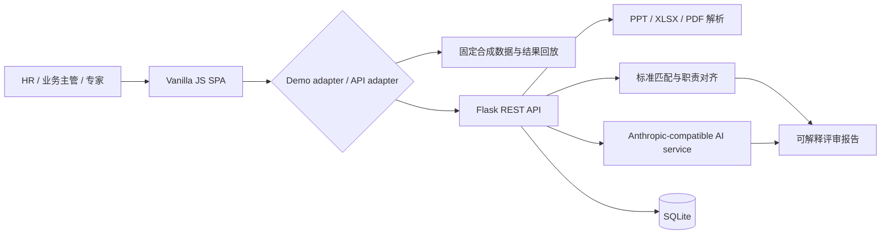
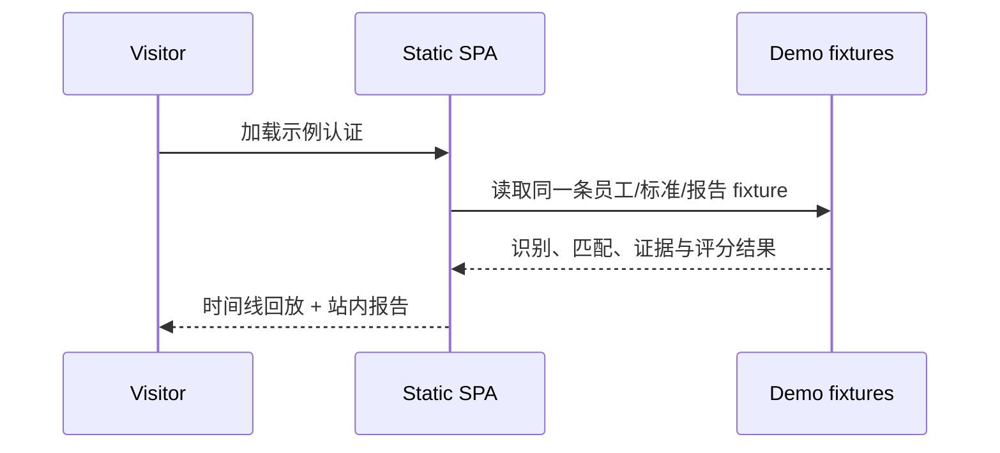

# 任职资格智能评审工作台

> 面向 HR、业务主管与专家评委的 AI 任职资格初筛工作台：把岗位标准、员工举证与可解释审核结论串成一条可追溯的工作流。

<p>
  <a href="https://banna-skech.github.io/qualification-ai-screening/"></a>
  <a href="https://github.com/Banna-skech/qualification-ai-screening/actions"></a>
  
  
</p>

## 先看结果

**在线演示（推荐）**：<https://banna-skech.github.io/qualification-ai-screening/>

打开后可以直接体验三条路径：

1. **单人认证**：加载示例材料 → 识别员工信息 → 匹配岗位标准 → AI 评审回放 → 站内查看报告；
2. **批量认证**：加载 5 条示例任务 → 查看并发队列、匹配状态与处理进度；
3. **标准审核**：浏览岗位标准摘要、职责结构与示例级别。

演示站点使用固定 fixture 和合成数据，不调用真实模型、不上传用户文件。报告与标准仅支持页面内阅读，不提供 Word、PDF、Excel、TXT 或其他文件下载。

## 它解决什么问题

传统任职资格评审通常需要人工打开多份 PPT，对照不同版本的岗位标准，再手工汇总结论，容易出现三个问题：

- **标准不统一**：岗位标准、版本和适用范围分散在文件夹中；
- **证据不可追溯**：结论有了，但很难快速回答“依据哪一页、哪条要求”；
- **流程不可观测**：批量任务失败、重试和人工复核边界不透明。

本项目将评审拆成可观察、可解释的步骤：

```text
举证材料 → 信息识别 → 标准匹配 → 证据对齐 → 职责判定 → 差距分析 → 专家复核
```

## 核心能力

| 模块 | 能力 | 评审者看到的结果 |
| --- | --- | --- |
| 新认证 | PPT 解析、员工信息识别、标准候选匹配 | 识别结果、匹配依据、置信度与可人工修正入口 |
| AI 评审 | 按职责对齐关键成果、关键行为、知识技能与学历经验 | 0/1/2 职责评分、证据引用、判断理由与差距 |
| 报告管理 | 搜索、筛选、详情、归档、报告对比 | 统一上下文的站内报告阅读页 |
| 批量认证 | 多文件队列、并发处理、耗时与失败状态 | 任务级进度、失败原因、可重试状态 |
| 标准管理 | 标准摘要、职责结构、版本与健康度 | 站内结构化预览，不暴露源文件 |
| 员工档案 | 员工基本信息、认证历史、分数趋势 | 从个人视角追踪认证轨迹与能力差距 |
| 安全边界 | 合成数据、固定回放、无密钥前端、专家复核提示 | 适合作品集展示，不冒充真实 HR 决策系统 |

## 评分与结论口径

当前规则以“职责”为评分单位：

- `0`：缺失，未找到可支持该职责的有效证据；
- `1`：部分覆盖，有相关证据但完整性或量化程度不足；
- `2`：完全覆盖，证据与标准要求清晰对应。

总分由职责结果汇总，系统输出“通过 / 有条件通过 / 不通过”三类初筛结论。结论用于辅助评审，不替代专家判断，也不直接触发晋升、淘汰或薪酬决策。

## 设计与工程亮点

### 1. Demo 与正式后端解耦

公开站点是静态 SPA，页面通过 `demo-fixtures` 和 API adapter 回放稳定数据；正式环境可以替换 adapter 接入 Flask API，而不改变页面交互契约。

### 2. 结果可解释，而不是只给一个分数

每个职责都保留标准条目、证据页码、证据摘要、覆盖度和 AI 判断理由，便于专家快速复核，也方便定位“缺材料”与“标准不匹配”。

### 3. 批量任务具备状态一致性

批量处理采用队列与并发 worker 模型，区分解析中、匹配中、分析中、完成、失败和可重试状态；任务 ID/版本约束用于避免旧响应覆盖新输入。

### 4. 公开演示默认安全

演示版不保存 API Key，不上传本地文件，不暴露岗位标准源文件与输出报告目录；所有公开对象均为脱敏后的合成数据。

## 系统架构



### 公开演示数据流



## 技术栈

| 层级 | 技术选型 |
| --- | --- |
| Web 后端 | Python、Flask、SQLAlchemy |
| 数据库 | SQLite（本地/轻量部署） |
| 前端 | 原生 JavaScript SPA、CSS、Canvas 图表 |
| AI 接入 | Anthropic-compatible API adapter（正式环境可配置） |
| 文件解析 | `python-pptx`、`openpyxl`、`pdfplumber` |
| 部署 | GitHub Pages（公开 Demo）/ Render（可选后端） |

## 本地运行

### 仅查看静态演示

```bash
git clone https://github.com/Banna-skech/qualification-ai-screening.git
cd qualification-ai-screening
python -m http.server 8000 --directory docs
```

浏览器访问 <http://localhost:8000>。

### 启动 Flask 后端

```bash
cd web_app
python -m venv .venv

# macOS / Linux
source .venv/bin/activate

# Windows PowerShell
# .venv\Scripts\Activate.ps1

pip install -r requirements.txt
python app.py
```

浏览器访问 <http://localhost:5890>。

> 公开 Demo 不需要 API Key。只有在本地接入真实模型时，才需要通过环境变量配置密钥；请勿将密钥写入代码、提交记录或前端资源。

## 配置项（正式后端）

| 变量 | 必填 | 说明 |
| --- | --- | --- |
| `DEEPSEEK_API_KEY` | 真实模型场景必填 | 模型服务密钥，仅在服务端读取 |
| `AI_MODEL` | 否 | 模型名称，默认值见 `web_app/config.py` |
| `AI_BASE_URL` | 否 | Anthropic-compatible API 地址 |
| `AI_MAX_TOKENS` | 否 | 单次生成上限 |
| `SECRET_KEY` | 生产环境建议 | Flask session 签名密钥 |

## 项目结构

```text
qualification-ai-screening/
├── docs/                         # GitHub Pages 静态演示版
│   ├── index.html
│   └── static/
│       ├── css/style.css
│       └── js/
│           ├── demo-fixtures.js  # 精选合成数据与结果回放
│           ├── api.js            # Demo / 正式 API 适配层
│           └── pages/            # Dashboard、认证、报告、标准、员工、批量、设置
├── web_app/                      # Flask 正式后端
│   ├── app.py
│   ├── models/                   # 员工、标准、报告、批量任务模型
│   ├── routes/                   # REST、SSE 与管理路由
│   ├── services/                 # AI 服务与文件解析服务
│   └── requirements.txt
├── 标准注册表/                   # 标准索引（内部运行时使用）
├── 岗位标准/                     # 本地标准源文件（不进入公开 Demo）
└── CLAUDE.md                     # CLI Agent 工作流与提示词说明
```

## 安全与隐私边界

- 公开 Demo 只使用合成姓名、部门、岗位、文件名、日期和评分；
- 不上传访问者选择的本地文件，不调用真实模型；
- 不在页面中展示 API Key、真实 Base URL 或内部路径；
- 不提供任何报告、岗位标准或举证材料下载 URL；
- 真实业务上线前，应完成密钥轮换、敏感词扫描、文件清单扫描、权限控制和专家复核流程设计。

## 当前范围与后续方向

当前公开站点聚焦“可体验、可解释、可验证”的评审主链路，刻意不展示正式版全量岗位、序列、职级与职档体系。

后续可按实际业务需要扩展：

- 接入企业 SSO、组织架构与权限模型；
- 增加人工复核工作台与审计日志；
- 增加标准版本差异对比与质量评审；
- 用脱敏评测集持续评估匹配准确率、证据召回率和任务耗时。

## 作品集 / 简历表述参考

> 设计并实现任职资格智能评审工作台，采用 Flask + 原生 SPA 构建标准、证据与审核结论的一体化流程；通过固定 fixture、任务状态机、证据引用和 Demo/API adapter 实现可解释 AI 评审回放，在公开演示环境中完成数据脱敏、密钥隔离、无下载约束与 GitHub Pages 部署。

## License

当前仓库沿用原项目的 MIT License 声明；如需将项目用于商业部署，请结合企业内部合规与数据安全要求完成审查。
